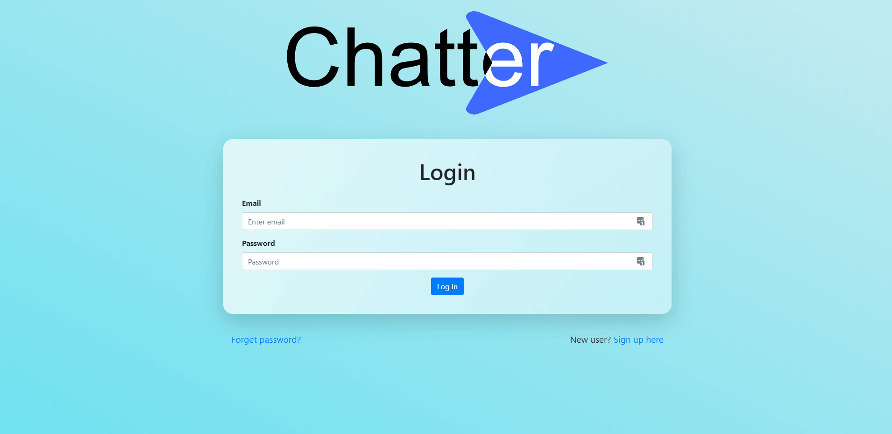

# Chatter


A chatting app built on React-Firebase-Websockets that allows you to chat via text with random people.


## Demo




Login screen ^^


Chat Screen ^^

## Packages

* [react](https://reactjs.org/)
* [react-router-dom](https://reactrouter.com/web/guides/quick-start)
* [react-bootstrap](https://react-bootstrap.github.io/)
* [bootstrap](https://getbootstrap.com/)
* [react-icons](https://www.npmjs.com/package/react-icons)
* [react-google-recaptcha-v3](https://www.npmjs.com/package/react-google-recaptcha-v3)
* firebase


## Firebase

Firestore properties for user:

```firebase
rules_version = '2';
service cloud.firestore {
  match /databases/{database}/documents {
    match /{document=**} {
      allow write: if false;
      allow read: if request.auth.uid != null;
    }
    
    // allow user to change own data 
    match /user/{userId} {
    	allow write: if request.auth.uid == userId;
    }
  }
}
```


